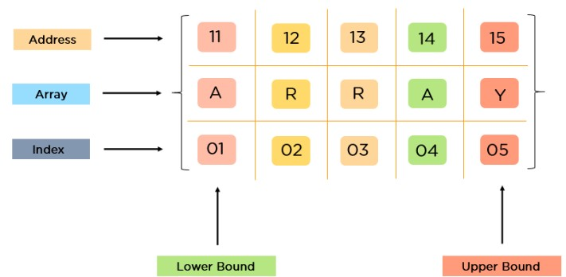
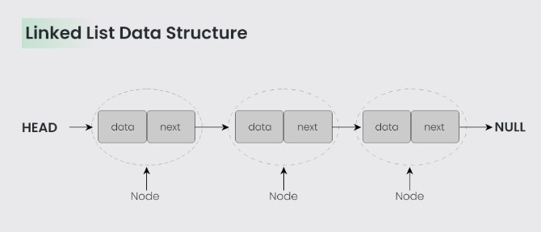

import {Align, Tag} from '@site/src/components/Tag';

# Linear Data structure

A linear data structure is a type of data structure that stores the data linearly or sequentially. In the linear data structure, data is arranged in such a way that one element is adjacent to its previous and the next element. It includes the data at a single level such that we can traverse all data into a single run.

## Arrays

an array is a data structure consisting of a collection of elements (values or variables), of same memory size, each identified by at least one array index or key. An array is stored such that the position of each element can be computed from its index tuple by a mathematical formula.

<Align>

</Align>

How Do You Initialize an Array?

```
int n;

scanf(“%d”,&n);

int arr[n];

for(int i=0;i<5;i++)

{

scanf(“%d”,&arr[i]);

}
```

What Operations Can You Perform on an Array?
Traversal
Insertion
Deletion
Searching
Sorting

Traversal in an array is a process of visiting each element once.

Code:
```
#include<stdio.h>

int main()

{

int a[5] = {2, 3, 5, 7, 11};

for(int i=0;i<5;i++)

{

//traversing ith element in the array

printf(“%d\n”,a[i]); 

}
}
```

## Linked List

a linked list is a linear collection of data elements whose order is not given by their physical placement in memory. Instead, each element points to the next. It is a data structure consisting of a collection of nodes which together represent a sequence.

<Align>

</Align>

Assuming that someNode is some node in a non-empty circular singly linked list, this code iterates through that list starting with someNode:
```
function iterate(someNode)
    if someNode ≠ null
        node := someNode
    do
        do something with node.value
        node := node.next
    while node ≠ someNode

```

Notice that the test "while node ≠ someNode" must be at the end of the loop. If the test was moved to the beginning of the loop, the procedure would fail whenever the list had only one node.

This function inserts a node "newNode" into a circular linked list after a given node "node". If "node" is null, it assumes that the list is empty.
```
function insertAfter(Node node, Node newNode)
    if node = null    // assume list is empty
        newNode.next := newNode
    else
        newNode.next := node.next
        node.next := newNode
    update lastNode variable if necessary
```

## Stack

Lorem ipsum dolor sit amet, consectetur adipiscing elit, sed do eiusmod tempor incididunt ut labore et dolore magna aliqua. Ut enim ad minim veniam, quis nostrud exercitation ullamco laboris nisi ut aliquip ex ea commodo consequat. Duis aute irure dolor in reprehenderit in voluptate velit esse cillum dolore eu fugiat nulla pariatur. Excepteur sint occaecat cupidatat non proident, sunt in culpa qui officia deserunt mollit anim id est laborum.

## Queue

Lorem ipsum dolor sit amet, consectetur adipiscing elit, sed do eiusmod tempor incididunt ut labore et dolore magna aliqua. Ut enim ad minim veniam, quis nostrud exercitation ullamco laboris nisi ut aliquip ex ea commodo consequat. Duis aute irure dolor in reprehenderit in voluptate velit esse cillum dolore eu fugiat nulla pariatur. Excepteur sint occaecat cupidatat non proident, sunt in culpa qui officia deserunt mollit anim id est laborum.